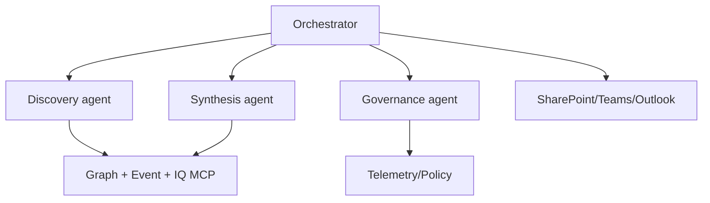

# Prototype: Cross-Agent Orchestration

## Scenario
An orchestrator agent that coordinates specialized agents (discovery, synthesis, governance) and MCP tools to deliver end-to-end event workflows with governance built-in.

## Agent graph
- Orchestrator: Control + routing
- Sub-agents: Event Discovery, Research Synthesis, Governance/Telemetry
- Shared tools: Graph MCP, Fabric/Foundry IQ, SharePoint MCP authoring, log_agent_telemetry, Foundry catalog tools (CRM/Logic Apps)

## Example flows & prompts
- "Plan a VIP visit: find 3 demos, prepare a 2-slide brief, and email logistics to the entourage; log all actions for audit." 
- "Collect feedback from Teams channel, summarize top issues, and open follow-up tasks in a SharePoint list." 
- "Run a dry-run of tomorrow's agenda, flag schedule conflicts, and propose fixes." 

## Future implementation notes
- Implement policy-aware router that inspects intent and data sensitivity before selecting agents/tools.
- Add parallel tool execution with dependency checks; merge responses with provenance.
- Provide admin override hooks (pause agent, force dry-run) exposed via Teams/Foundry Control Plane.
