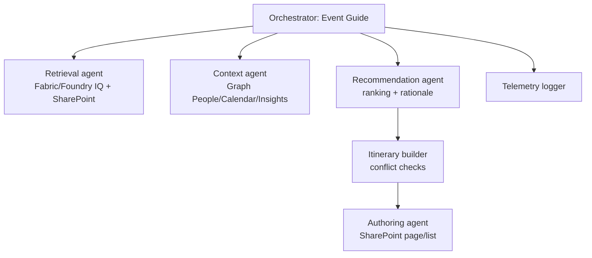

# Prototype: Event Discovery Agent

## Scenario
Attendee-facing agent that recommends MSR projects, demos, and sessions with explainable rankings, using Graph signals, Work IQ, and event feeds.

## Agent graph
- Orchestrator: Event Guide
- Sub-agents: retrieval, recommendation, itinerary builder, authoring
- Tools: Graph People/Calendar/Insights, search_event_content, query_foundry_iq, create_sharepoint_page/list, log_agent_telemetry

## Example flows & prompts
- "Given my calendar from 1-4pm and my Work IQ interests in AI safety, recommend a 3-stop route; avoid conflicts and show walking time."
- "Create a SharePoint page with my picks and share to Teams #msr-event." 
- "Explain why you ranked these Fabric IQ demos above Agent 365 ones." 

## Future implementation notes
- Add Work IQ + Graph signal fusion scorer; expose feature weights in responses.
- Build itinerary conflict checker (location/time) and buffer insertion.
- Wire SharePoint page/list creation with Purview labeling and telemetry logging.
