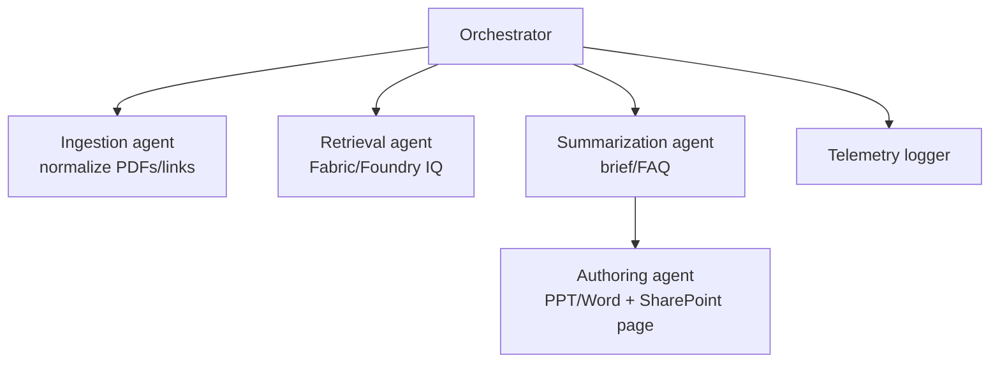

# Prototype: Research Synthesis Agent

## Scenario
Agent that ingests BoN-style content, research papers, and demo assets to produce briefs, FAQs, and decks for event staff and leadership.

## Agent graph
- Orchestrator: Synthesis conductor
- Sub-agents: ingestion/normalization, retrieval (Fabric/Foundry IQ), summarization, Office authoring
- Tools: query_fabric_iq, Graph Files, search_sharepoint_library_with_metadata, PPT/Word agents, create_sharepoint_page, log_agent_telemetry

## Example flows & prompts
- "Summarize all BoN items tagged 'Foundry IQ' into a 1-page brief with citations; save to SharePoint." 
- "Create a 3-slide deck comparing Agent 365 vs Work IQ benefits for event staff; no custom styling." 
- "Generate an FAQ for demo staff using yesterday's Edge bookmarks and Work IQ notes." 

## Future implementation notes
- Build ingestion pipeline that labels content with topics and Purview labels before indexing.
- Add evaluation harness for citation coverage and hallucination checks.
- Implement style guardrail sub-agent that enforces Office-un-styled outputs.
